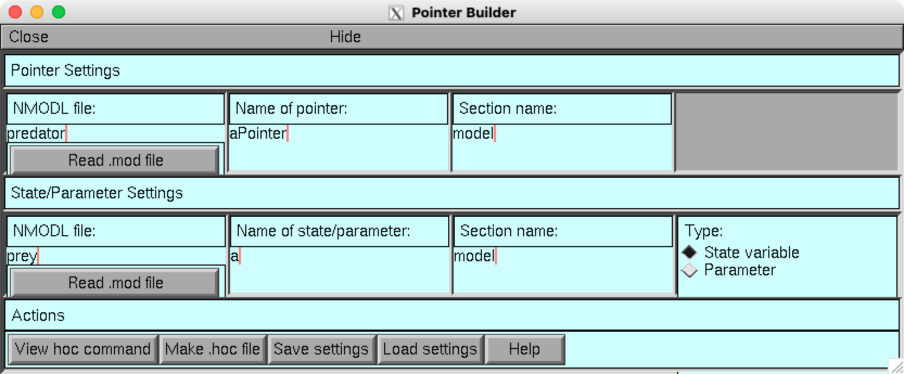

# PointerBuilder: App for NEURON
This app is a GUI for the NEURON environment and is a tool for working with pointers in NEURON simulations. The main repository is located at https://github.com/fietkiewicz/PointerBuilder. Address questions and comments to Dr. Chris Fietkiewicz (fietkiewicz@hws.edu).

## Description
This tool is intended for users who wish to work with the hoc language. It is written using the native NEURON library for GUI development and does not require Python.

As an example, you may click "Load settings" and select the provided file "lotka_volterra.txt". This should load settings that are appropriate for the [Lotka-Volterra model](https://github.com/fietkiewicz/PointerBuilder/tree/main/Models/1-LotkaVolterra/Neuron) as seen here:

