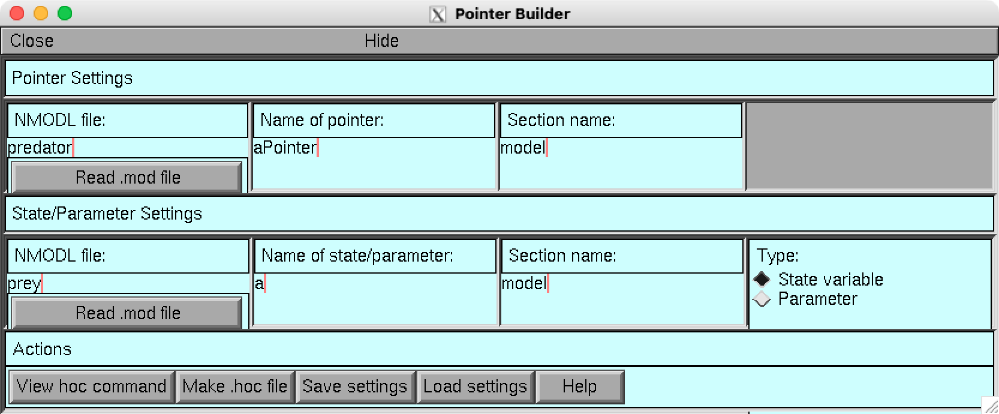
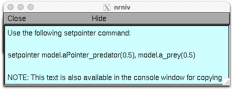

# PointerBuilder: App for NEURON
This app is a GUI for the NEURON environment. It is a tool for working with pointers in NEURON simulations and is intended for users who wish to work with the hoc language. It is written using the native NEURON library for GUI development and does not require Python. The main repository is located at https://github.com/fietkiewicz/PointerBuilder. Questions and comments can be sent to Dr. Chris Fietkiewicz (fietkiewicz@hws.edu). A detailed discussion about this app is given in Appendix 5.3 in the following paper:

Fietkiewicz, C., Corrales Marco, D., Chiel, H. J. and Thomas, P. J. (accepted). Tutorial: Using NEURON for Neuromechanical Simulations. *Frontiers in Computational Neuroscience*.

## Example
As an example, you may click "Load settings" and select the provided file "lotka_volterra.txt". This should load settings that are appropriate for the [Lotka-Volterra model](https://github.com/fietkiewicz/PointerBuilder/tree/main/Models/1-LotkaVolterra/Neuron), as seen below.

After loading the file described above, you may click "View hoc command" and see the full hoc command that can be used to set the pointer. Below is an example.

There are two ways to automatically copy the text for use in a program. One way is to use the NEURON console window, where the complete text can be selected and then copied to the clipboard. The second way is to click the "Make .hoc file" button which saves the instruction to a .hoc file.
