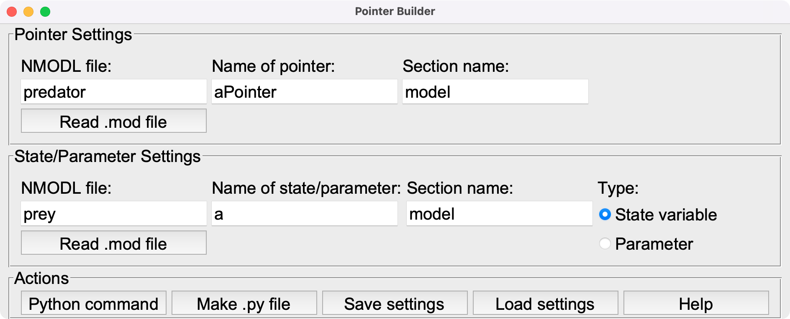
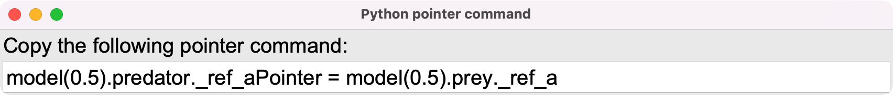

# PointerBuilder: App for NEURON
This app is a GUI that requires Python. It is a tool for working with pointers in NEURON simulations and is intended for users who wish to work with the Python language. It is written using the Tkinter library for Python. The main repository is located at https://github.com/fietkiewicz/PointerBuilder. Questions and comments can be sent to Dr. Chris Fietkiewicz (fietkiewicz@hws.edu). A detailed discussion about this app is given in Appendix 5.3 in the following paper:

Fietkiewicz, C., Corrales Marco, D., Chiel, H. J. and Thomas, P. J. (accepted). Tutorial: Using NEURON for Neuromechanical Simulations. *Frontiers in Computational Neuroscience*.

## Example
As an example, you may click "Load settings" and select the provided file "lotka_volterra.csv". This should load settings that are appropriate for the [Lotka-Volterra model](https://github.com/fietkiewicz/PointerBuilder/tree/main/Models/1-LotkaVolterra/Neuron), as seen below.

After loading the file described above, you may click "Python command" and see the full command that can be used to set the pointer. Below is an example.

The window shown above allows you to select the text and copy it to the clipboard. Alternatively, you may click the "Make .py file" button which saves the instruction to a .py file.
